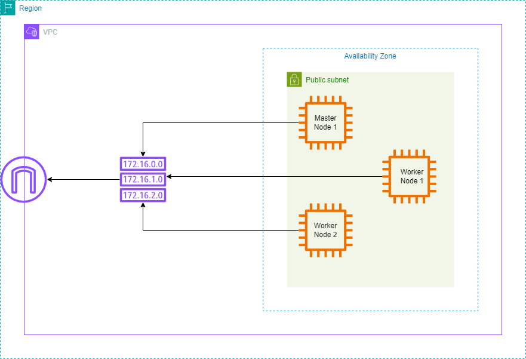

# <p align="center">WCD-Project-1 - Linux Servers on AWS</p>
**URL:** [WCD Project 1 (Linux Servers on AWS)](https://github.com/RakinKhan/WCD-Project-1)
<br/>
**Group Members:** Lara, Farius, Juan, Rakin

## Architecture


## Setup Instructions
The following files allows for the utilization of bash shell scripts to create and provision Cloud Infrastructure. Using the ```project-vpc-setup.sh``` script, the user can set up a VPC environment. Within the VPC environment, a Public Subnet be created that is attached to an Internet Gateway using a routing table. Within the Public Subnet there will be 3 accompanying ec2 Instances with public IP addresses assigned so that Python, Node, Java, and Docker packages can be installed into all three of them. The commands to be run within the ec2 instances are found within the ```user-data.txt``` file within this directory. Each resource will be given individual tags in order to identify resourses for the scripts to run and on AWS Web.

The following steps require an installation of the AWS CLI and Git-Bash (as this project was completed on Windows), and an access/secret key credentials from AWS. Once you have installed AWS CLI and Git-Bash, proceed with the following.

1. In the terminal type ```aws configure``` in order for allowing your AWS CLI to interact with AWS. From there set your access key, secret key, default region, and output format. It should look like this:
```
C:\> aws configure

AWS Access Key ID:(Write Your Access Key)
AWS Secret Access Key:(Write Your Secret Access Key)
Default region name [us-east-1]: us-east-1 (Write your region)
Default output format [None]: json (write your format)
```

2. Once you have set up your AWS credentials, open your Git-Bash terminal with the project directory being the current working directory. Once you have done so you may now run the following command in the bash shell:
```
$ sh project-vpc-shared.sh
```
The script will then begin to create your AWS VPC Environment along with the necessary resources and associations. TO see exactly what resources will be installed, please view the comments in the ```project-vpc-shared.sh``` file. As the file is created a ```.pem``` key will be created which will allow you to ssh into the instances. 

3. Once the script is done running, please wait a few minutes while the the respective packages are being installed into the ec2 instances. To ssh into the instances, run the commands in the terminal (with the project folder as the current directory):
```
ssh -i Project-KP.pem ec2-user@<Public IP of EC2 instance> 
```
To find the public ip of each of the EC2 instances you can check the EC2 section in the AWS Website.

4. Once you check that everything has been installed properly, you can log out of the instance and delete the whole infrastructure created by the ```project-vpc-setup.sh``` script. To delete, you must run the ```delete-infrastructure.sh``` shell script in the Git-Bash terminal with the project as the current working directory:
```
$ sh delete-infrastructure.sh
```
The script will be deleting the resources in the specific order set up in the script. This is so that there wont be a dependency conflict that will prevent resources to be deleted. you can check the AWS Web to make sure all resources have been deleted.